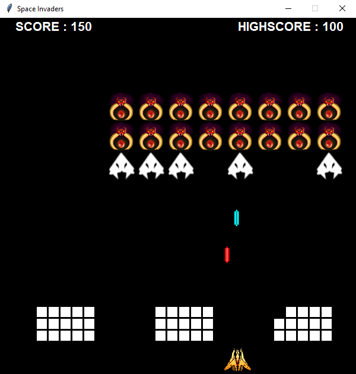

# Space Invaders - Python Tk game  
This project is a Space Invaders Game created in our 1st year of school at CPE Lyon.   
It's based on Python 3.7 with Tkinter. 
The project is totally Object-Oriented Programed (notice that we weren't exactly aware of the OOP principles at the time, however), resulting in a very clear code and it was a good entry point to develop our development skills.
*All the program and comments are in French.*

